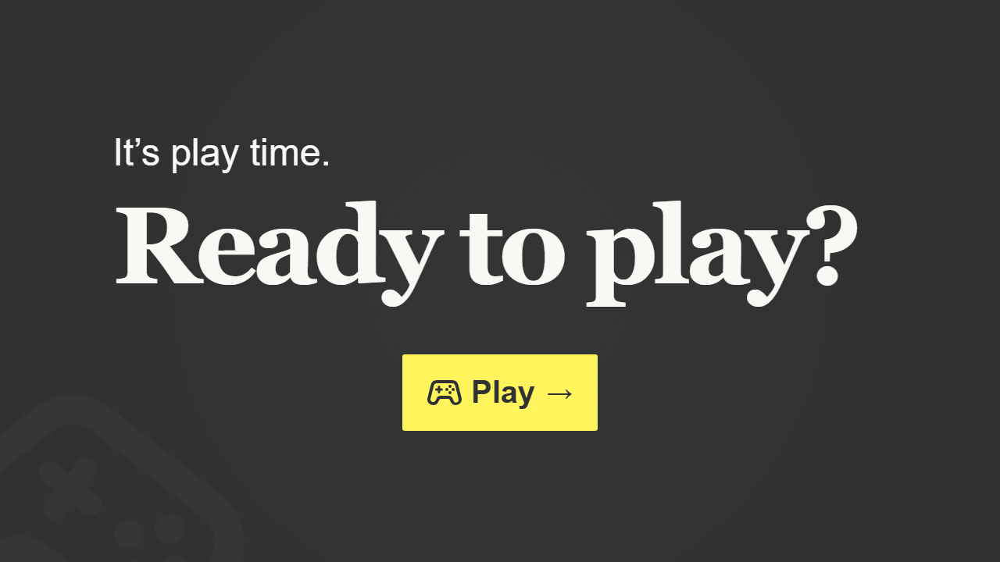

# Memory

Memory ist ein lokales Zwei-Spieler-Spiel für den Browser. Beide Personen spielen am selben Gerät, sammeln gefundene Kartenpaare und wechseln sich nach einem Fehlversuch ab.

Das Projekt entsteht als Lernprojekt mit semantischem HTML, streng typisiertem TypeScript und modular aufgebautem SCSS – ohne JavaScript-Framework.



## Funktionen

- Zwei auswählbare Themes: **Code Vibes** und **DA Projects**
- Spielerwahl zwischen Blau und Orange
- Spielfelder mit `4 × 4`, `4 × 6` oder `6 × 6` Karten
- Zufällig gemischte Kartenpaare passend zum gewählten Theme
- Kartenbedienung mit Maus und Tastatur
- Automatischer Kartenvergleich und Spielerwechsel
- Punktestand und Anzeige des aktiven Spielers
- Bestätigungsdialog zum Verlassen eines Spiels
- Game-over-, Gewinner- und Unentschieden-Ansichten
- Responsive Darstellung und sichtbare Fokuszustände
- Berücksichtigung reduzierter Bewegung über `prefers-reduced-motion`

## Spielregeln

Die ausgewählte Spielerfarbe beginnt. Ein gefundenes Paar bleibt sichtbar, zählt einen Punkt und die Person darf weiterspielen. Bei zwei unterschiedlichen Karten werden diese wieder verdeckt und die andere Person ist am Zug. Das Spiel endet, sobald alle Paare gefunden wurden.

## Technologien

- HTML5
- TypeScript
- SCSS
- Vite
- Node.js Test Runner

## Lokal starten

Voraussetzung ist eine aktuelle Installation von Node.js und npm.

```bash
npm install
npm run dev
```

Vite zeigt anschließend die lokale Adresse im Terminal an.

## Qualität prüfen

```bash
npm run quality-check
```

Der Befehl führt die automatisierten Tests, die TypeScript-Prüfung und den Produktions-Build aus.

## Projektstatus

Das Spiel befindet sich in aktiver Entwicklung. Die grundlegenden Spielabläufe und beide Themes sind umgesetzt; weitere Detailarbeit und der vollständige Abnahmetest folgen schrittweise.

## Assets

Die verwendeten Designvorlagen, Schriften, Kartenmotive und Icons wurden für das Projekt bereitgestellt beziehungsweise von der Developer Akademie freigegeben. Es wurden keine Bild-Assets generiert.
